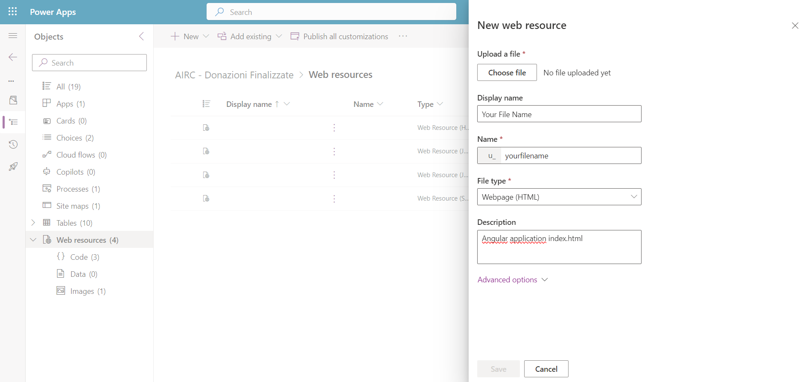

# Angular-d365-crm-injection
This GitHub project demonstrates how to create and develop an Angular application injected into Dynamics 365 as a web resource. It details the process of using Webpack to bundle CSS and JavaScript into a single file, ensuring that only two web resources need to be loaded. The guide is comprehensive and provides instructions on how to integrate these resources into a Dynamics 365 form.

# Summary
- [New or Updating Projects](#newupdate-project-steps)
- [Run Project](#how-to-run-this-project)

#Setting Up or Updating Projects:

## Step 1
Create a New Project: Use the Angular CLI to generate a new project. Replace *'your-project-name'* with your desired project name.
```
ng new your-progeject your-project-name
```

## Step 2
If the project already exists: remove the node_modules folder and the package-lock.json file before continuing

## Step 3
Install webpack, webpack-cli, style-loader and css-loader with the following command
```npm install webpack webpack-cli style-loader css-loader --save-dev```

## Step 4
Customize *app.component.html*: clear any default content from app.component.html and insert your own, like [this](./src/angular%20app/src/app/app.component.html).

## Step 5 
Create Webpack Configuration: create a *webpack.config.js* file in the root folder. Update the entry section with the path to the dist file generated after running the ```ng build --output-hashing=none``` (see [Step 8 to configure parameterless command](#step-8)

	module.exports = {
		mode: 'production',
		entry: {
			"bundle.js": [
				path.resolve(__dirname, "./src/angular app/dist/your-project-name/browser/main.js"),
				path.resolve(__dirname, "./src/angular app/dist/your-project-name/browser/polyfills.js"),
				path.resolve(__dirname, "./src/angular app/dist/your-project-name/browser/styles.css"),
				//some other paths...
			],
		},
		output: {
			filename: 'bundle.js',
			path: path.resolve(__dirname, 'dist'),
		},
		module: {
			rules: [
				{
					test: /\.css$/i,
					use: ["style-loader", "css-loader"],
				},
			],
		},
	};
Note: **This dist folder is located at ./src/angular app/dist/your-project-name/browser**, check your root path!

## Step 6
Remove the base <href="/"> tag from *index.html* and add the following line inside the <head> tag: 
```<script src="https://your-project-name.crm4.dynamics.com/WebResources/bundle-logical-name" type="module"crossorigin="anonymous"></script>```

EXTRA: If you want to run the Angular app via HTML injection, update the ***main.js*** file with the following code:
			 
		document.addEventListener('DOMContentLoaded', () => {			  
		const appRoot = document.createElement('app-root');
		document.body.appendChild(appRoot);
		bootstrapApplication(AppComponent, appConfig)
			.then(() => console.log('Angular Bootstrap succeded'))
			.catch((err) => console.error('Angular Bootstrap error:', err));
		});
			 
**NOTE**: your selector prefix is different, ensure you update the tag with your specific main selector.	

## Step 7 
Set up your dependencies and styles, and begin development. Once done, build the project, update the bundle.js file using Webpack, and follow these steps to create and upload the bundle.

## Step 8
```ng build --output-hashing=none```

I recommend updating **angular.json** under ***architect:build:configurations:production***, setting *outputHashing* to *'none'* as shown below, and then using the regular *ng build* command.
Tip: Angular typically appends a hash to files like main.js. This command disables that behavior. Always verify the contents of the dist folder.

 

## Step 9
```npx webpack --config webpack.config.js```

Keep in mind: if Webpack throws errors, double-check the contents of the dist folder, especially for files like *main.js* that may still contain hashes if output hashing wasn't disabled correctly.

## Step 10
The [***index.html***](./src/angular%20app/src/index.html) file may contain invalid bundle links. 
Update these with your correct paths.
After building, Angular will copy it to the dist folder. Always delete extra scripts and styles generated by Angular, only ***bundle.js*** script is needed.
**Tip**: Don’t remove inline styles inside <style>...</style> tags.

## Step 11
Deploy the Resources in PowerApps: open your solution in PowerApps, add or update the web resources and save.
- create a new web resource 
- then compile form and choose your *index.html* dist folder and save. 
- Create a second resource for bundle.js, add file and a save.

## Step 12
Add the Web Resource to Your Form: add the web resource to the desired form, then save and publish.

- select and publish both files 
- Once published, navigate to the HTML web resource, and under the "Advanced" options, you'll find the resource link. You can use this to access your app. 
- Enjoy your Angular-D365 integration!!
  

# How to run this project:
- Ensure [Node.js(https://nodejs.org/en)] is installed.
- Open the project folder in the terminal and run ```npm i```	
-  To start the app on *http://localhost:4200*, run  ```ng serve```

